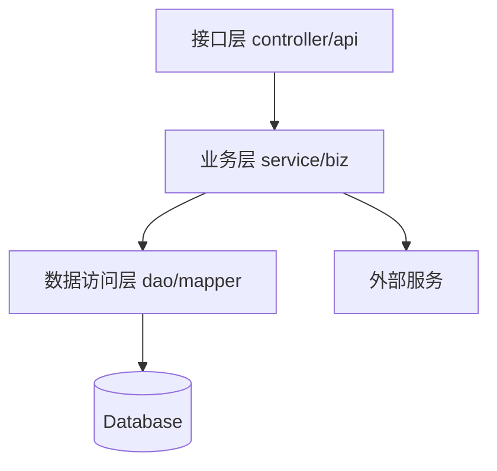
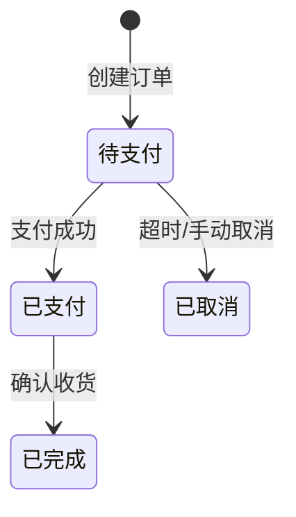
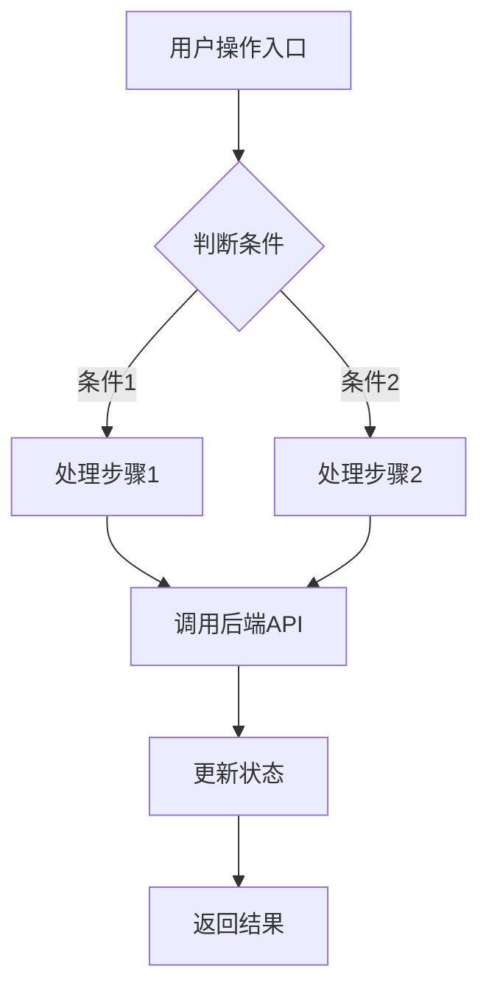
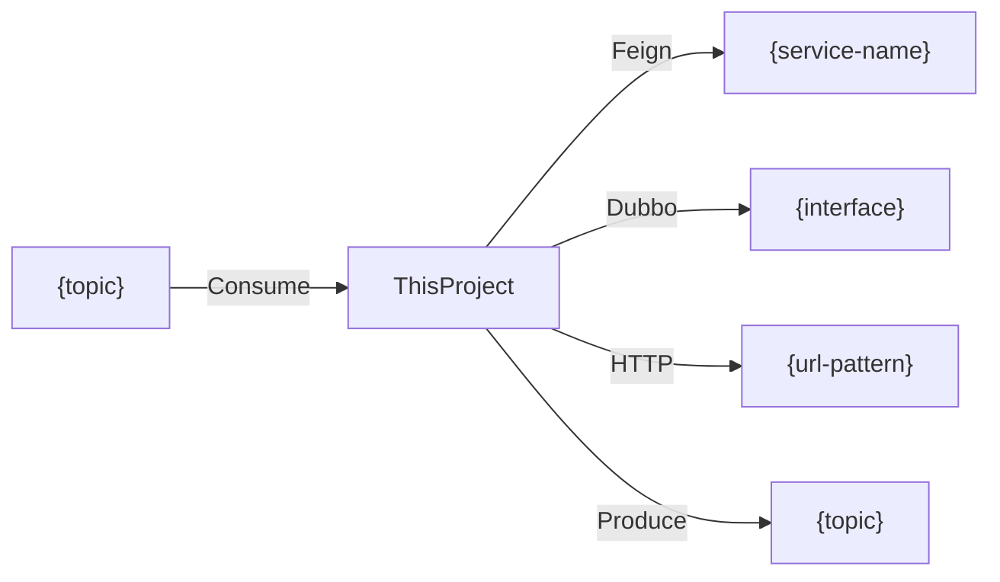

# Project Knowledge Template

Output this file at `docs/knowledge-base/project-knowledge.md`. Fill all sections from scan results.

```markdown
# {project-name} 项目知识库

## 项目概览

| 属性 | 值 |
|------|---|
| 语言 | {language} |
| 框架 | {framework} {version} |
| 构建工具 | {build-tool} |
| Java 版本 | {java-version} |
| 架构风格 | {MVC/DDD/Custom} |
| 基础包 | `{base.package}` |

{2-3 段项目描述：做什么、服务谁、核心业务}

## 模块结构

| 模块 | artifactId | 职责 | 依赖 |
|------|-----------|------|------|
| {module-dir} | {artifact-id} | {purpose} | {depends-on} |

## 架构分层



| 层级 | 包路径 | 职责 | 约定 |
|------|--------|------|------|
| 接口层 | `{pkg}.controller` | 接收请求、参数校验、响应封装 | 不含业务逻辑 |
| 业务层 | `{pkg}.service` | 业务编排、事务管理 | 单一职责 |
| 数据访问层 | `{pkg}.dao` | 数据持久化 | 仅 CRUD |
| ... | ... | ... | ... |

## 技术栈

| 类别 | 组件 | 版本 | 用途 |
|------|------|------|------|
| 框架 | {spring-boot} | {ver} | 应用框架 |
| ORM | {mybatis/jpa} | {ver} | 数据访问 |
| 缓存 | {redis} | {ver} | 缓存/分布式锁 |
| 消息队列 | {kafka/rocketmq} | {ver} | 异步消息 |
| 数据库 | {mysql} | {ver} | 持久化 |
| HTTP 客户端 | {feign/okhttp} | {ver} | 服务调用 |
| 监控 | {micrometer} | {ver} | 指标采集 |

## API 端点

### {ControllerName}

Base path: `{base-path}`

| 方法 | 路径 | 处理方法 | 说明 |
|------|------|----------|------|
| GET | `/xxx` | `methodName()` | {description} |
| POST | `/xxx` | `methodName()` | {description} |

## 数据库

### ER 关系图

<!-- Grouping rule: if tables ≤ 15, use one diagram below. If > 15, split into multiple
     sub-sections by business domain (one per main table + its relationship chain),
     plus a "公共表" group for orphan tables, and a summary diagram showing inter-group links. -->

```mermaid
erDiagram
    {TABLE_A} ||--o{ {TABLE_B} : "has many"
    {TABLE_A} ..o{ {TABLE_C} : "suspected"
    
    {TABLE_A} {
        bigint id PK
        varchar name
        tinyint status "1=xxx, 2=yyy"
    }
```

说明：实线 = 确认关系（代码+命名），虚线 = 疑似关系（仅命名推断）

### 表清单

| 表名 | 注释 | 行数(估) | 主要字段 | 状态字段 |
|------|------|----------|----------|----------|
| {table} | {comment} | {rows} | {key-fields} | {status-values} |

### 枚举/状态值

| 表.字段 | 值 | 含义 | 来源 |
|---------|---|------|------|
| {table}.status | 1 | 待支付 | {EnumClass} |

## 业务流程

### 状态机



### 操作流程图



说明：每个核心业务生成一张操作流程图，展示用户操作 → 前端页面 → API 调用 → 后端处理 → 状态变更的完整链路。多步骤业务（如下单→支付→发货）拆分为子流程。

### 定时任务

| 类 | 方法 | Cron | 说明 |
|----|------|------|------|
| {ClassName} | {method} | `{cron-expr}` | {description} |

### 事件监听

| 类 | 事件/Topic | 说明 |
|----|-----------|------|
| {ClassName} | {event-type-or-topic} | {description} |

## 外部服务依赖



| 类型 | 服务/接口 | 调用方式 | 说明 |
|------|----------|----------|------|
| Feign | {service-name} | {methods} | {purpose} |
| Dubbo | {interface} | {version/group} | {purpose} |

## 配置

### Profile 列表

| Profile | 用途 | 数据源 | Redis | MQ |
|---------|------|--------|-------|-----|
| dev | 开发 | {host:port/db} | {host:port} | {broker} |
| test | 测试 | ... | ... | ... |

### 配置中心

{Apollo/Nacos/无 — 说明 namespace 和 key 组织方式}

## 快速上手

1. 克隆项目：`git clone {repo-url}`
2. 配置数据源：修改 `application-dev.yml`
3. 构建：`{build-command}`
4. 启动：`{run-command}`
5. 访问：`http://localhost:{port}`

<!-- scan-commit: {HEAD-sha} | scan-date: {YYYY-MM-DD} -->
```

## Template Rules

- Replace all `{...}` placeholders with actual scan results
- Remove sections that have no data (e.g., no MQ → remove MQ rows)
- Mermaid diagrams: use actual table/service names, not placeholders
- ER diagram: solid lines (`||--o{`) for confirmed, dotted (`..o{`) for suspected
- State diagram: one per main table that has status transitions
- Module flowchart: show actual inter-module and external dependencies
- Business flowchart: one per core business process, showing user operation → page → API → backend → state change chain
- Keep table rows sorted: by importance or alphabetically
- Status values: always include meaning labels from enum scan
- `{repo-url}`: obtain from `git remote get-url origin`; if not a git repo or no remote configured, omit the clone step entirely
- `{port}`: extract from `server.port` in application config; default to 8080 if not specified
